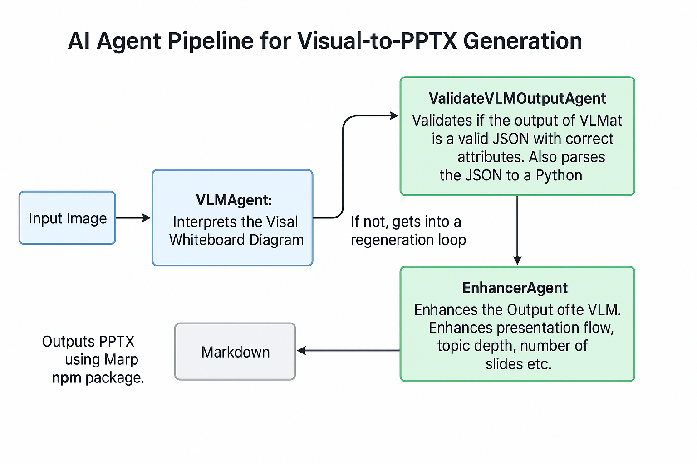

# OWL: Object-to-Word Language

Convert your whiteboard photos and diagram drawings into beautiful presentations instantly! OWL uses advanced AI to transform your handwritten notes and sketches into professional PowerPoint presentations with just a few clicks.



##  Features

- **Image to Presentation**: Upload images of whiteboards, diagrams, or handwritten notes
- **Multi-language Support**: Generate presentations in multiple languages
- **AI-Powered**: Utilizes state-of-the-art Vision Language Models (VLM) for accurate text and diagram recognition
- **Customizable Output**: Get presentations tailored to your preferred style and format
- **Real-time Preview**: See your presentation take shape as you upload images

## Quick Start

### Installation

1. Clone the repository:
   ```bash
   git clone https://github.com/yourusername/owl.git
   cd owl
   ```

2. Install dependencies:
   ```bash
   pip install -r requirements.txt
   npm install @marp-team/marp-cli
   npm install jsonrepair
   ```

3. Set up environment variables:
   ```bash
   cp .env.example .env
   # Update the .env file with your API keys and configurations
   ```

### Running the Application

1. Start the backend server:
   ```bash
   adk api_server
   ```

2. In a new terminal, start the Streamlit frontend:
   ```bash
   streamlit run frontend.py
   ```

3. Open your browser and navigate to `http://localhost:8501`

## How to Use

1. **Upload an Image**
   - Click "Upload Image" and select your whiteboard or diagram photo
   - Supported formats: JPG, JPEG, PNG, WebP

2. **Choose Language**
   - Select your preferred language for the presentation
   - Currently supported: English, French, German, Italian, Spanish

3. **Generate & Download**
   - Click "Generate Presentation"
   - Preview the generated slides
   - Download the PowerPoint file when ready

## Technical Details

### Architecture

- **Frontend**: Streamlit-based web interface
- **Backend**: FastAPI server
- **AI Models**:
  - Vision Language Model (VLM) for image understanding (NVIDIA Nemotron)
  - Language Model (LLM) for content enhancement
